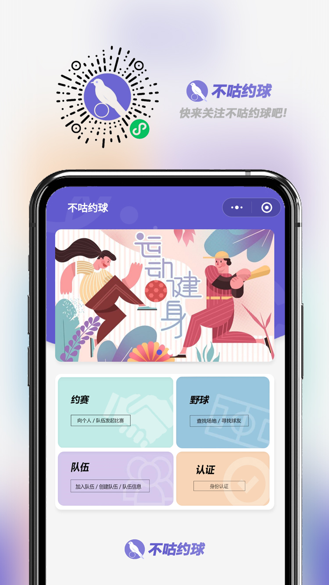
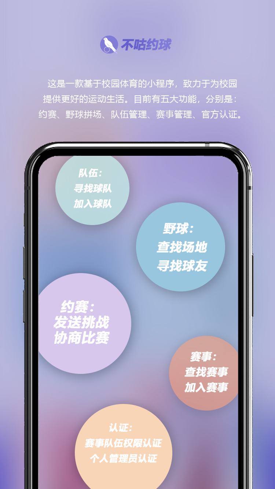
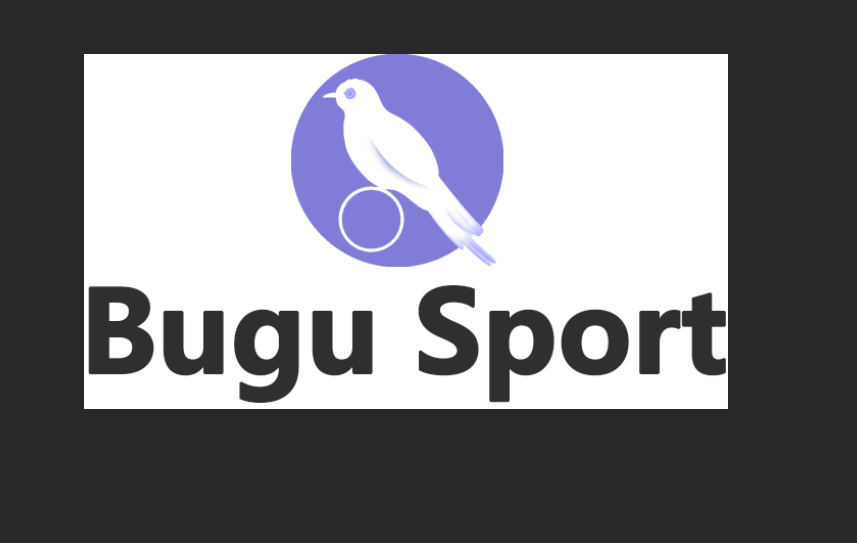
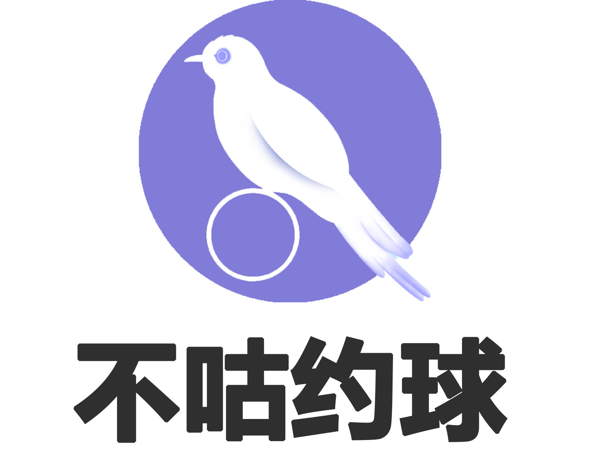

### [English](https://github.com/HeXavi8/Bugu-Sport) | 中文

#  

不咕约球是一个以校园体育为主题的微信小程序，用户以学生群体为主，包括大学生、中小学生。
官方网站: www.bugusport.com

## Table of Contents
* [海报](#Poster)
* [使用](#Usage)
* [文档](#Documentations)
* [例子](#Examples)
* [设计](#Design)
* [项目成员](#Project_Members)
* [License](#License)

## 海报 

&emsp; 

## 使用 

不咕约球是基于微信平台的小程序。如果您想体验这个软件，请下载微信并扫描二维码。

## 文档 
- [中文介绍](./中文介绍)

## 例子 

- [聊天室](./examples/chatroom)
- [评分](./examples/grade)

我们会持续发布部分项目demo...

## 设计 

不咕约球的Logo和用户界面是由 [Abbey Yang](https://github.com/AbbeyYang) 设计的。  

 

## 项目成员 

| **GitHub** | **昵称** | **电子邮件** | **代词** |
|------------|----------|--------------|----------|
| [Xavi](https://github.com/HeXavi8) | **Xavi He** | 825308876 [at] qq [dot] com | he/him |
| [kapuskasing](https://github.com/kapuskasing) | **Kapuskasing Su** | kunmingsu [at] outlook [dot] com | he/him |
| [LI-SUJU](https://github.com/LI-SUJU) | **LI SUJU** | lisuju [at] outlook [dot] com, risokyo [at] foxmail [dot] com | he/him |
| [AbbeyYang](https://github.com/AbbeyYang) | **Abbey Yang** | 745482092 [at] qq [dot] com | he/him |
| [RuidaZeng](https://github.com/RuidaZeng) | **Ruida Zeng** | ruida_zeng [at] alumni [dot] brown [dot] edu | he/him |

如果您有任何建议或者想与我们合作，请随时与我们联系。  

## License 

[MIT](./LICENSE)
